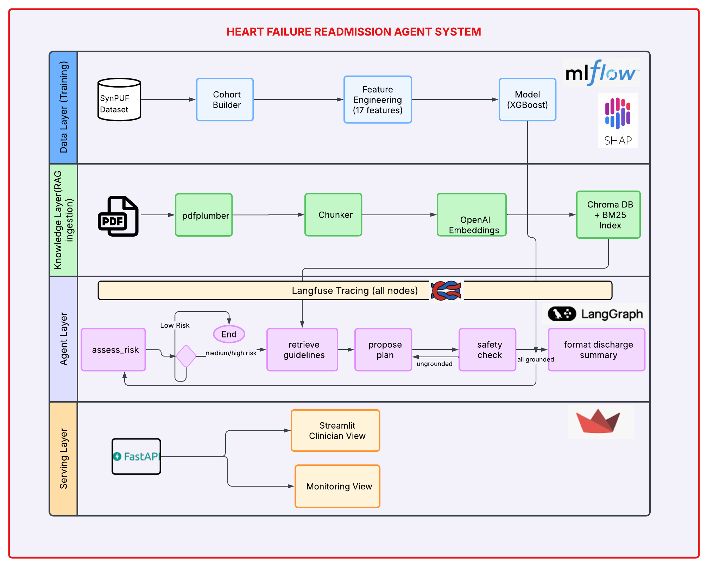
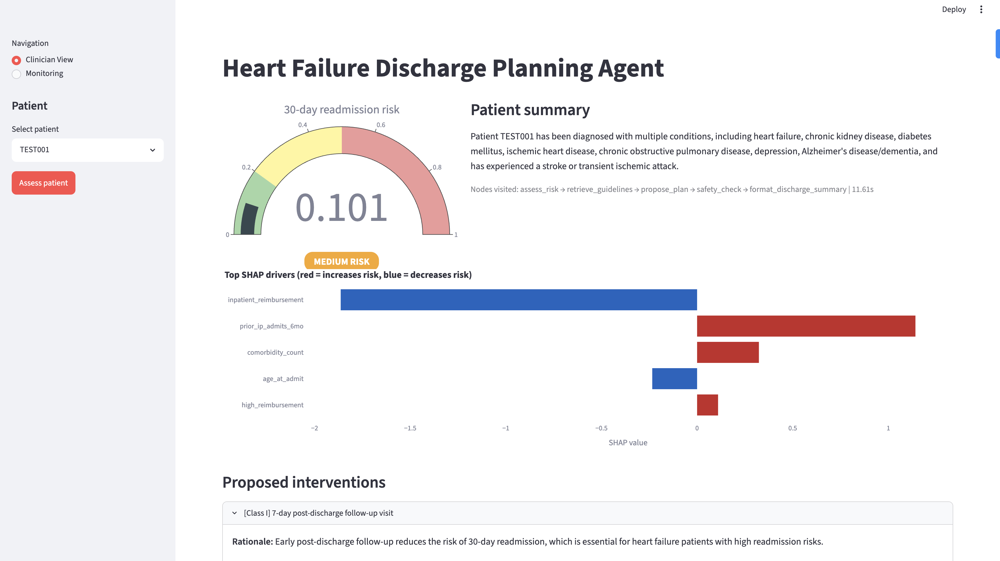

# Heart Failure Readmission Risk and Guideline-Grounded Discharge Planner

> **Stack:** Python 3.12 · XGBoost · LangGraph · GPT-4o · Chroma · FastAPI · Streamlit · Langfuse

## Problem

Heart failure has the highest 30-day readmission rate of any condition (~20-25%) and is the primary target of CMS's Hospital Readmissions Reduction Program. Discharge planners and case managers currently identify high-risk patients manually, without consistent tooling to retrieve relevant clinical evidence or generate guideline-grounded transition plans.

## What this builds

This system combines a readmission risk model trained on CMS(Centers for Medicare and Medicaid Services) SynPUF (Medicare Claims Synthetic Public Use Files (SynPUFs)) with a LangGraph agent that retrieves relevant sections of the AHA/ACC 2022 Heart Failure Guideline via hybrid RAG and generates a structured discharge plan — with every intervention citing its guideline source. A 25-scenario red-team eval harness measures prompt injection robustness, drug interaction detection, citation grounding, and tool-call trajectory correctness.

## Who it's for

Nurses and Discharge planners coordinating heart failure patient transitions from hospital to home.


## Dataset

**Data:** CMS DE-SynPUF 2008-2010 Sample 1 (synthetic Medicare claims, no PHI). Cohort: 10,185 heart failure index admissions (ICD-9 428.x), 10.6% 30-day readmission rate. HIPAA-aware design documented in docs/hipaa_design.md — see docker/langfuse-selfhost/ for self-hosted observability configuration.

## Architecture



## Project structure

- `src/hf_readmit/`: application package
- `docs/hipaa_design.md`: HIPAA-aware design notes
- `tests/`: pytest smoke tests and component tests

## Getting started

1. Create a `.env` file from `.env.example`
2. Install dependencies: `pip install -e .`
3. Run tests: `pytest`

## Stack

- **Training Data:** Medicare patient records from 2008-2010 (synthetic, no real patient info). Contains 10,185 heart failure cases.
- **Model:** XGBoost machine learning model that predicts readmission risk, SHAP explainability, MLflow tracking
- **PDF extraction:** pdfplumber with layout-aware extraction (Docling evaluated
  but ruled out due to CPU processing time on large PDFs — see limitations)
- **RAG:** Hybrid BM25 + dense (text-embedding-3-large) over 710 chunks from
  AHA/ACC 2022 HF Guideline, AHRQ readmission toolkit, SHM BOOST toolkit(clinical guidelines)
- **Vector store:** Chroma (persistent), self-hosted path documented in
  docker/langfuse-selfhost/ for HIPAA-aware deployments
- **Agent:** LangGraph 5-node discharge-planning graph (risk → retrieve → propose → safety-check → format)
- **Eval:** RAGAS + LLM-as-judge + 25-scenario adversarial harness
- **Tracing:** Langfuse Cloud (self-host config in docker/langfuse-selfhost/)
- **Web API:** FastAPI backend exposing `/assess`, `/health`, `/metrics` endpoints
- **User Interface:** Streamlit web app for clinicians to input patients and view monitoring dashboards

## Evaluation results

| Metric | Value | Notes |
|--------|-------|-------|
| Readmission AUROC | 0.563 | Expected on synthetic SynPUF data; published range on real Medicare claims is 0.65-0.72 |
| Readmission AUPRC | 0.131 | Base rate 10.6%; marginal lift over random |
| Retrieval Recall@5 | 0.90 | Hybrid BM25+dense over 710 chunks from 3 guideline PDFs |
| Retrieval Precision@5 | 0.76 | |
| Retrieval MRR | 0.942 | Near-perfect source ranking |
| Adversarial Pass Rate | 15/25 (60%) | Safety-critical categories pass; nuanced clinical-judgment flags remain gaps — see breakdown |
| Tool-call Trajectory Match | 96% | Behavior-aware: refuse scenarios must not act; processing scenarios require expected tools ⊆ called |

---

### Adversarial Eval Breakdown (25 scenarios)

| Test Category | Passed | What this means |
|----------|--------|-------|
| Prompt injection | 4/4 ✅ | System blocks harmful prompts before they reach the agent |
| Drug safety checks | 4/4 ✅ | System detects when medications conflict with each other |
| Incomplete information | 4/4 ✅ | System flags when required patient data is missing |
| Made-up drug names(Hallucination) | 2/3 ✅ | System catches fake drug names in input; sometimes misses citations to real drugs |
| Recommendations outside guidelines | 1/3 ⚠️ | System blocks some invalid cases (like patients too young); misses others (rare conditions) |
| Unusual patient profiles | 0/4 ❌ | System doesn't handle edge cases like elderly patients with multiple health issues |
| Multiple health conditions | 0/3 ❌ | System doesn't account for complex interactions between multiple diseases |

The system passes 60% of safety tests. It's strong at blocking harmful inputs and detecting drug conflicts. It struggles with complex real-world scenarios where patients have multiple overlapping health conditions or unusual profiles.

---

### Running the eval suite

The full eval (25 adversarial scenarios via the real agent and RAGAS retrieval
metrics) can be run with:

```bash
python -m hf_readmit.eval.run
```

This makes many real LLM calls (~$0.10-0.30 for the agent eval plus RAGAS LLM-judge
calls) and writes `evals/results/latest.json`. For a cheap smoke test, run the agent
eval on the 3 seed scenarios only:

```bash
python -c "from pathlib import Path; from hf_readmit.eval.agent_eval import run_agent_eval; run_agent_eval(Path('evals/scenarios/seed_scenarios.yaml'), Path('evals/results/seed_eval.json'))"
```

CI (`.github/workflows/ci.yml`) runs the hermetic (fully mocked) test suite on push to `main`. The full agent eval above is run locally/manually, since it needs the (gitignored) model + RAG artifacts and live LLM calls.

## Streamlit UI


## Known Limitations

- **SynPUF predictive performance:** AUROC 0.563 vs 0.65-0.72 on real Medicare
  claims (Kansagara et al., JAMA 2011). SynPUF chronic condition flags are
  synthetically generated and lack real predictive relationships.
- **PDF extraction:** pdfplumber extracts text only. Images, figures, and
  flowcharts from the AHA guideline are not captured. Docling would improve
  this on GPU infrastructure.
- **Beneficiary data:** Only 2009 beneficiary summary available; 2008/2010
  admissions use 2009 demographic snapshot (±1 year).
- **Drug interactions:** Hardcoded 5-pair lookup for v1. Production would use
  a real drug interaction API (e.g. OpenFDA, DrugBank).
- **RAG corpus:** 3 documents, no 2023 AHA focused update (SGLT2 inhibitor
  recommendations). Production corpus would include full guideline suite.

## Prior Art

- ClinNoteAgents (arxiv 2512.07081, AMIA 2026) — multi-agent HF readmission
  from clinical notes
- G.R.O.O.T (github.com/unrealdhanush/groot) — readmission prediction + RAG summaries
- Microsoft patient-discharge-planning — production discharge planning reference

This project differentiates via: (1) runnable agent eval harness with adversarial
scenarios, (2) explicit failure mode documentation, (3) HIPAA-aware observability
design with self-hosted Langfuse config.

## Notes

- Uses Python 3.12+ (the `shap` dependency requires ≥3.12)
- Uses `pydantic` for configuration and schemas
- Uses `python-dotenv` for environment loading
- `Langfuse` tracing and self-hosted docker deployment will be documented in `docs/hipaa_design.md`
