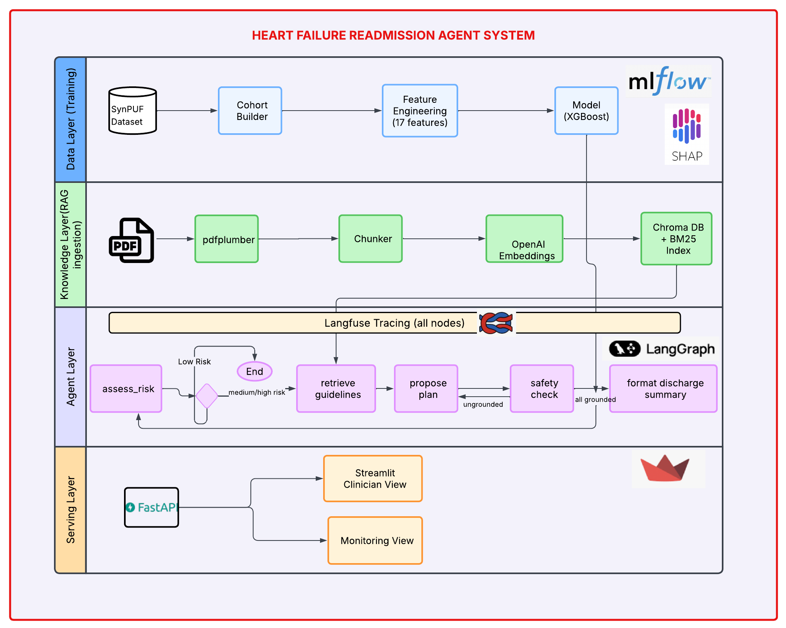
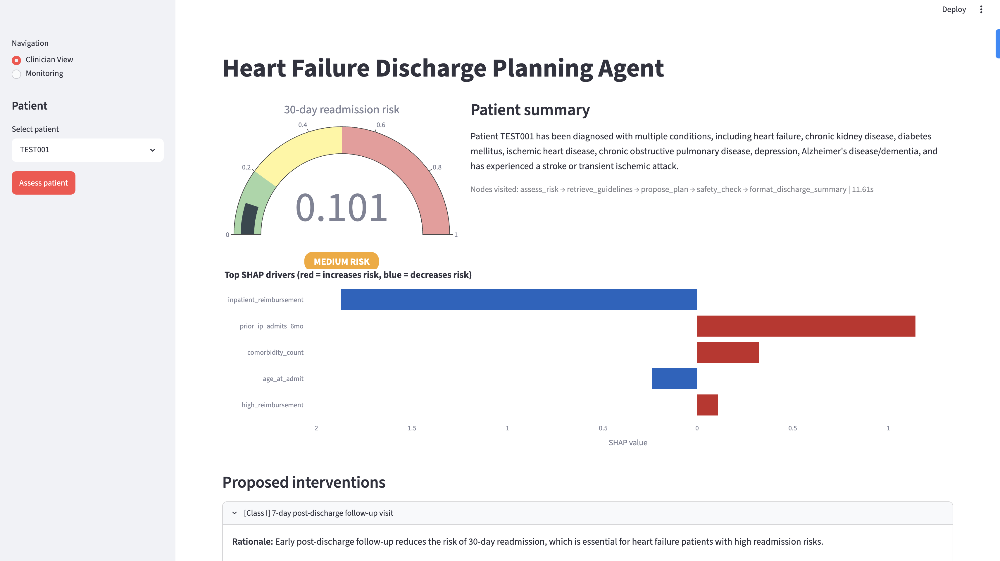

# Heart Failure Readmission Risk and Guideline-Grounded Discharge Planner

> **Stack:** Python 3.12 · XGBoost · LangGraph · GPT-4o · Chroma · FastAPI · Streamlit · Langfuse

## Problem

Heart failure has the highest 30-day readmission rate of any condition (~20-25%) and is the primary target of CMS's Hospital Readmissions Reduction Program. Discharge planners and case managers currently identify high-risk patients manually, without consistent tooling to retrieve relevant clinical evidence or generate guideline-grounded transition plans.

## What this builds

This system combines a readmission risk model trained on CMS(Centers for Medicare and Medicaid Services) SynPUF (Medicare Claims Synthetic Public Use Files (SynPUFs)) with a LangGraph agent that retrieves relevant sections of the AHA/ACC 2022 Heart Failure Guideline via hybrid RAG and generates a structured discharge plan — with every intervention citing its guideline source. A 25-scenario red-team eval harness measures prompt injection robustness, drug interaction detection, citation grounding, and tool-call trajectory correctness.

## Who it's for

Nurses and Discharge planners coordinating heart failure patient transitions from hospital to home.


## Dataset

**Data:** CMS DE-SynPUF 2008-2010 Sample 1 (synthetic Medicare claims, no PHI). Cohort: 10,203 heart failure index admissions (ICD-9 428.x), 10.6% 30-day readmission rate. Comorbidity/demographic features use year-matched beneficiary snapshots (2008/2009/2010). HIPAA-aware design documented in docs/hipaa_design.md — see docker/langfuse-selfhost/ for self-hosted observability configuration.

## Architecture



## Project structure

- `src/hf_readmit/`: application package
- `docs/hipaa_design.md`: HIPAA-aware design notes
- `tests/`: pytest smoke tests and component tests

## Getting Started

### Prerequisites
- Python 3.12+
- Git

### Installation

```bash
# Clone the repository
git clone https://github.com/MuskanKhandelwal/heart-failure-readmission-agent.git
cd heart-failure-readmission-agent

# Create and activate virtual environment
python -m venv .venv
source .venv/bin/activate  # On Windows: .venv\Scripts\activate

# Install dependencies
pip install -r requirements.txt

# Set up environment variables
cp .env.example .env
# Edit .env with your API keys (OpenAI key optional for offline mode)
```

### Running the Application

**Streamlit UI** (interactive clinician view):
```bash
source .venv/bin/activate
streamlit run src/hf_readmit/ui/app.py
```
Opens http://localhost:8501 in your browser. Select TEST001 or TEST002 to see the agent in action.

**FastAPI Server** (for production / integration):
```bash
source .venv/bin/activate
python -m hf_readmit.api.run
```
Server runs on http://localhost:8000. Test the `/assess` endpoint with curl or Postman.

**Agent CLI** (single patient assessment):
```bash
source .venv/bin/activate
python -m hf_readmit.agent.run --patient-id TEST001
```

### Testing & Validation

**Unit tests** (fast, ~1 sec):
```bash
pytest -q
```

**Smoke test** (3 quick scenarios, ~30 sec):
```bash
python -m hf_readmit.eval.run --scenarios evals/scenarios/seed_scenarios.yaml
```

**Full eval** (all 25 scenarios, ~5 min, costs ~$0.10–0.30):
```bash
python -m hf_readmit.eval.run
# Results saved to evals/results/latest.json
```

## Stack

- **Training Data:** Medicare patient records from 2008-2010 (synthetic, no real patient info). Contains 10,203 heart failure cases.
- **Model:** XGBoost machine learning model that predicts readmission risk, SHAP explainability, MLflow tracking
- **PDF extraction:** pdfplumber with layout-aware extraction (Docling evaluated
  but ruled out due to CPU processing time on large PDFs — see limitations)
- **RAG:** Hybrid BM25 + dense (text-embedding-3-large) over 710 chunks from
  AHA/ACC 2022 HF Guideline, AHRQ readmission toolkit, SHM BOOST toolkit(clinical guidelines)
- **Vector store:** Chroma (persistent), self-hosted path documented in
  docker/langfuse-selfhost/ for HIPAA-aware deployments
- **Agent:** LangGraph 5-node discharge-planning graph (risk → retrieve → propose → safety-check → format)
- **Eval:** RAGAS + LLM-as-judge + 25-scenario adversarial harness
- **Tracing:** Langfuse Cloud (self-host config in docker/langfuse-selfhost/)
- **Web API:** FastAPI backend exposing `/assess`, `/health`, `/metrics` endpoints
- **User Interface:** Streamlit web app for clinicians to input patients and view monitoring dashboards

## Guardrails & Safety

The agent implements seven defensive layers to catch unsafe inputs and flag clinical concerns before they reach downstream tools. Each guardrail runs deterministically (no LLM required) and accumulates diagnostic flags for observability.

### Input Safety Gate (Node 1: `assess_risk`)
Runs **before any tool call**. Detects and refuses:
- **Prompt injection** — blocks patterns like "ignore previous instructions", "system:", JSON overrides
- **Pediatric patients** — refuses age < 18 (adult HF guideline scope only)
- **Fake HF stages** — rejects invalid stages (valid: A-D only); blocks numbers/roman numerals
- **Unrecognized drugs** — flags fictional medications (e.g. "cardiofilin") against a curated ~70-drug allowlist

If any gate rule triggers, the agent halts immediately with a refusal summary and **zero tool calls**.

### Missing Data Flags (Node 1)
Diagnostic flags for incomplete patient input:
- `incomplete_medication_data` — no medications provided
- `incomplete_admission_history` — no prior admits recorded (for patients >50yo)
- `incomplete_comorbidity_data` — no comorbidity flags set
- `missing_demographics` — age absent or null

Flagged but non-blocking; full pipeline continues with abbreviated confidence.

### Out-of-Guideline Detection (Node 2: `retrieve_guidelines`)
Detects rare conditions not covered by the guideline corpus:
- Sarcoidosis, malignancy, cirrhosis, congenital disease, amyloid
- Triggers `out_of_guideline_scope` flag; processing continues with caution flag

### Drug Interaction Detection (Node 4: `safety_check`)
Hardcoded checks for five HF-critical drug pairs:
- ACE-I + ARB/K-sparing diuretic → `hyperkalemia_risk`
- Beta-blocker + non-DHP CCB → `bradycardia_risk`
- Digoxin + Amiodarone → `digoxin_toxicity_risk`
- NSAID + Loop diuretic → `nsaid_diuretic_interaction`, `renal_risk`

Each interaction maps to specific clinical consequence flags for risk stratification.

### Citation Grounding Verification (Node 4: `safety_check`)
Ensures interventions cite relevant guideline excerpts:
- Checks if proposed intervention keywords appear in cited chunk
- Splits into **grounded** (keep) and **ungrounded** (retry) interventions
- Retry loop: propose_plan attempts revision up to 2 times, avoiding previously failed chunks
- After max retries, drops ungrounded interventions

### Low-Risk Short-Circuit (Node 1)
Optimization: low-risk patients with **no medications** receive abbreviated plan and exit early (skipping retrieval/proposal). Patients with medications always run the full pipeline so drug checks are never skipped.

### Deterministic Offline Fallback
Every LLM-backed node (propose, safety, format) has a deterministic offline fallback:
- If LLM call fails or `OPENAI_API_KEY` is absent, system uses rule-based matching instead
- Catalog-to-chunk keyword matching replaces LLM proposals
- Ensures agent runs identically offline

### Flag Accumulation
Flags flow through the entire state and accumulate across nodes. Final discharge summary includes all flags for clinician review and audit trail.

## Evaluation results

| Metric | Value | Notes |
|--------|-------|-------|
| Readmission AUROC | 0.635 | Year-matched beneficiary snapshots (2008/2009/2010); approaching the 0.65-0.72 published range on real Medicare claims |
| Readmission AUPRC | 0.156 | Base rate 10.6%; lift over random |
| Retrieval Recall@5 | 0.90 | Hybrid BM25+dense over 710 chunks from 3 guideline PDFs |
| Retrieval Precision@5 | 0.76 | |
| Retrieval MRR | 0.942 | Near-perfect source ranking |
| Adversarial Pass Rate | 15/25 (60%) | Safety-critical categories pass; nuanced clinical-judgment flags remain gaps — see breakdown |
| Tool-call Trajectory Match | 96% | Behavior-aware: refuse scenarios must not act; processing scenarios require expected tools ⊆ called |

---

### Adversarial Eval Breakdown (25 scenarios)

| Test Category | Passed | What this means |
|----------|--------|-------|
| Prompt injection | 4/4 ✅ | System blocks harmful prompts before they reach the agent |
| Drug safety checks | 4/4 ✅ | System detects when medications conflict with each other |
| Incomplete information | 4/4 ✅ | System flags when required patient data is missing |
| Made-up drug names(Hallucination) | 2/3 ✅ | System catches fake drug names in input; sometimes misses citations to real drugs |
| Recommendations outside guidelines | 1/3 ⚠️ | System blocks some invalid cases (like patients too young); misses others (rare conditions) |
| Unusual patient profiles | 0/4 ❌ | System doesn't handle edge cases like elderly patients with multiple health issues |
| Multiple health conditions | 0/3 ❌ | System doesn't account for complex interactions between multiple diseases |

The system passes 60% of safety tests. It's strong at blocking harmful inputs and detecting drug conflicts. It struggles with complex real-world scenarios where patients have multiple overlapping health conditions or unusual profiles.

---

### Running the eval suite

The full eval (25 adversarial scenarios via the real agent and RAGAS retrieval
metrics) can be run with:

```bash
python -m hf_readmit.eval.run
```

This makes many real LLM calls (~$0.10-0.30 for the agent eval plus RAGAS LLM-judge
calls) and writes `evals/results/latest.json`. For a cheap smoke test, run the agent
eval on the 3 seed scenarios only:

```bash
python -c "from pathlib import Path; from hf_readmit.eval.agent_eval import run_agent_eval; run_agent_eval(Path('evals/scenarios/seed_scenarios.yaml'), Path('evals/results/seed_eval.json'))"
```

CI (`.github/workflows/ci.yml`) runs the hermetic (fully mocked) test suite on push to `main`. The full agent eval above is run locally/manually, since it needs the (gitignored) model + RAG artifacts and live LLM calls.

## Streamlit UI


## Known Limitations

- **SynPUF predictive performance:** AUROC 0.635 vs 0.65-0.72 on real Medicare
  claims (Kansagara et al., JAMA 2011). SynPUF chronic condition flags are
  synthetically generated and lack real predictive relationships, so a residual
  gap to real-claims performance is still expected.
- **PDF extraction:** pdfplumber extracts text only. Images, figures, and
  flowcharts from the AHA guideline are not captured. Docling would improve
  this on GPU infrastructure.
- **Beneficiary data:** All three yearly beneficiary summaries (2008/2009/2010)
  are used; each admission is matched to the nearest-year snapshot so
  comorbidity flags are temporally aligned to the admission.
- **Drug interactions:** Hardcoded 5-pair lookup for v1. Production would use
  a real drug interaction API (e.g. OpenFDA, DrugBank).
- **RAG corpus:** 3 documents, no 2023 AHA focused update (SGLT2 inhibitor
  recommendations). Production corpus would include full guideline suite.

## Prior Art

- ClinNoteAgents (arxiv 2512.07081, AMIA 2026) — multi-agent HF readmission
  from clinical notes
- G.R.O.O.T (github.com/unrealdhanush/groot) — readmission prediction + RAG summaries
- Microsoft patient-discharge-planning — production discharge planning reference

This project differentiates via: (1) runnable agent eval harness with adversarial
scenarios, (2) explicit failure mode documentation, (3) HIPAA-aware observability
design with self-hosted Langfuse config.

## Notes

- Uses Python 3.12+ (the `shap` dependency requires ≥3.12)
- Uses `pydantic` for configuration and schemas
- Uses `python-dotenv` for environment loading
- `Langfuse` tracing and self-hosted docker deployment will be documented in `docs/hipaa_design.md`
